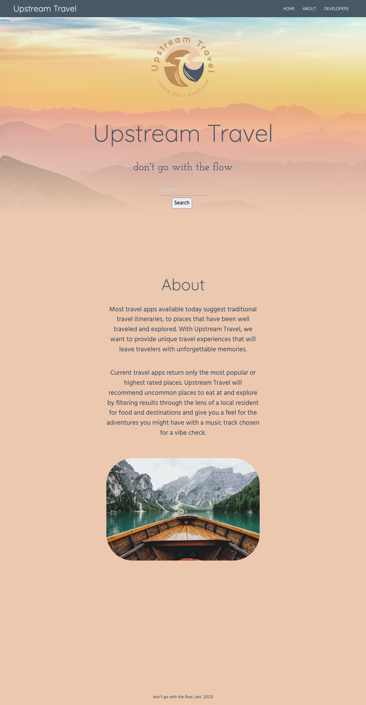

# Upstream Travel App

## Description

Upstream Travel is a travel app that helps users in find their dream travel destination. 

This app not only provides recommendations for restaurants and interesting sights, but also presents updated safety data and security ratings for thousands of cities and neighborhoods world wide. 

The safety ratings are based on six categories: women's safety, health, physical threats, theft, political freedom and LGBTQ safety

See how our site functions

<video width="700" controls>
  <source src="./assets/videos/user-input-demo.mp4" type="video/mp4">
  Your browser does not support the video tag.
</video>

 

See how our site looks on mobile

<video width="700" controls>
  <source src="./assets/videos/video-responsive-demo.mp4" type="video/mp4">
  Your browser does not support the video tag.
</video>

 

## Technology Used

- HTML - used to edit the existing elements.
- CSS - used to edit the styling for the html elements.
- JavaScript - used to add functionality and logic to the application.
- Git - used to track edits made to the source code.
- GitHub - used to host and deploy the repository.
- Amadeus for Developers - used to get safety and travel data API.
- Google Maps - used to get the map API.
- Coolors - used to generate color theme and palate
- Excalidraw - used to collaboratively draw wireframes

 

| Technology Used | Resource URL                                                      |
| --------------- | ----------------------------------------------------------------- |
| Materialize     | [https://materializecss.com/](https://materializecss.com)         |
| Postman         | [https://www.postman.com/](https://www.postman.com/)              |
| Amadeus         | [https://developers.amadeus.com/](https://developers.amadeus.com) |
| Google          | [https://developers.google.com/](https://developers.google.com/)  |
| Coolors          | [https://coolors.co/](https://coolors.co/)  |
| Excalidraw          | [https://excalidraw.com/](https://excalidraw.com/)  |

 

## User Stories 

MVP User stories

- As a solo/minority traveler, I want to view safety ratings for a location, so that I can know if the destination is relatively safe

- As a traveler, I want to search for restaurant recommendations, so that I can visit the top places to eat at the destination

- As a traveler, I want to view a travel application, so that I can discover local points of interest at the destination

- As a traveler, I want to view a map of the searched destination, so that I can view the city map information of the travel destination

## Materialize CSS Framework

We used Materalize, a responsive CSS framework to style our site. Materialize is based on material design principles. 

[Materialize](https://materializecss.com/)

## Learning points

We learned and had a lot of fun with this project. A few learning moments stand out
- How long it takes to set up and call a new API's depends on the documentation
- Determine what the costs and abilities of an API before committing to it
- Always check within what scope variables and functions are placed
- Be aware of timing for API fetch calls and event listeners 

 

## Deployment

Website URL: [Upstream Travel](https://elenagurchinskaia.github.io/upstream-travel)

 

## Author

### Elena Gurchinskaia

- [LinkedIn](https://www.linkedin.com/in/elena-gurchinskaia-4969ab104/)
- [Github](https://github.com/elenagurchinskaia/)

 

### Stephanie Lenorovitz

_Currently a student in the UC Berkley Full Stack Flex Bootcamp.

- [Portfolio](https://gypsyboho.github.io/Stephanies-1st-Portfolio/)
- [LinkedIn](https://www.linkedin.com/in/goodux/)
- [Github](https://github.com/GypsyBoho)

 

### Lainey Creighton

_Currently a student in the UC Berkley Full Stack Flex Bootcamp. Contact Below:_

- [Portfolio](https://laineycreighton.github.io/portfolio/)
- [LinkedIn](https://www.linkedin.com/in/lainey-creighton/)
- [Github](https://github.com/laineycreighton)

 

## License

N/A
